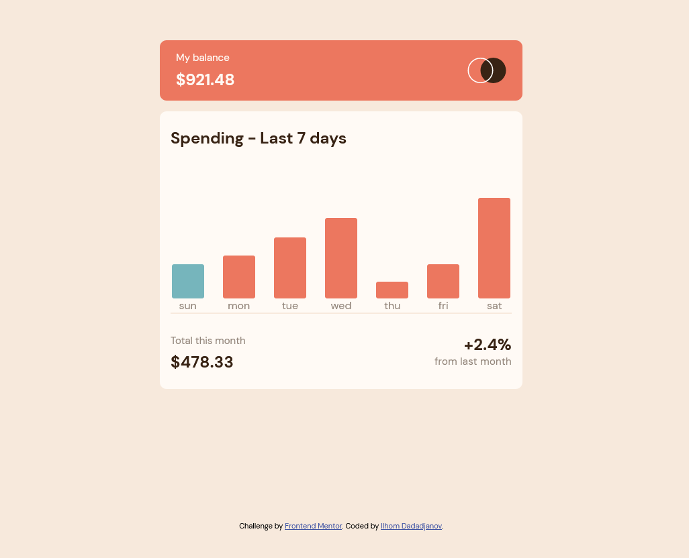

# Frontend Mentor - Expenses chart component

Another fun project from frontendmentor.io. HTML, CSS and JavaScript. Very good projects get to test their skills, especially when it comes to JavaScript. On a regular computer, you have to hover over to see information. On the touch screen, click on the diagram to see information. Feel free to try it at Netlify.com

Try on [Netlify.com](https://regal-cupcake-21ea9b.netlify.app/)
